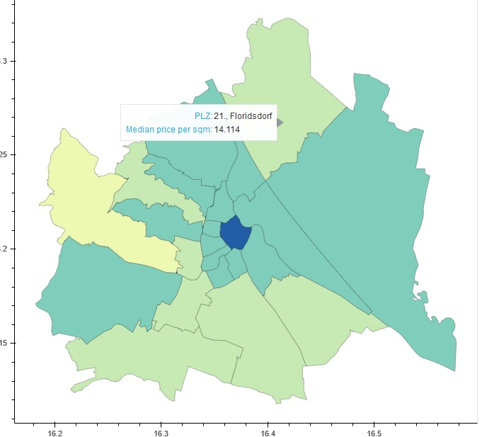
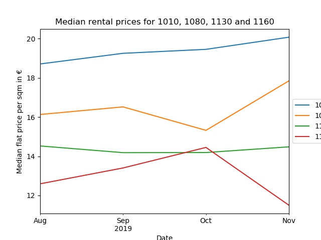

# Rental prices in Vienna

Data on apartments which are available for rent in Austria are collected in a MySQL database since August 2019. I filtered data from Vienna and displayed the development of the median rental prices over time. The median rental prices are also viewed on a map. In addition I used an ML model to try to predict median rental prices. Project can be viewed on [Google Colab](https://drive.google.com/open?id=1IQlD-ijFpHuK8Mb2NvtLIaCy6Z9_YV9n)

