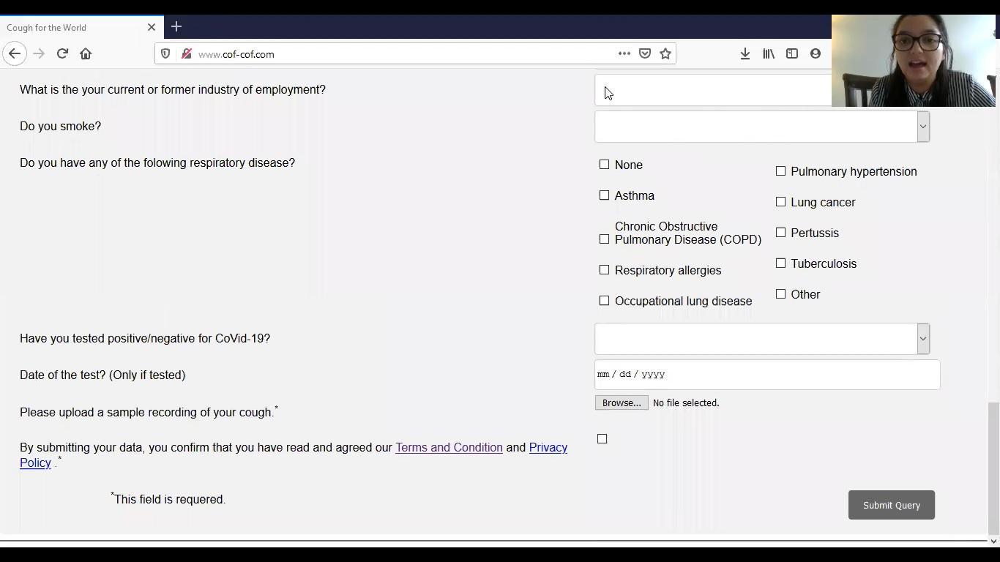

# Cough for the World

Tools to detect respiratory diseases such as asthma but also possibly for Covid-19 are needed. The goal of the tool is to advice to go to a doctor or to tell the participants that their status is unknown and they still may need medical advice. This could help to increase awareness for individuals who might not consider their coughing as a serious sign. 

Presentation of the finished project can be viewed on [Youtube](https://youtu.be/n_ywYdjZJLI)

